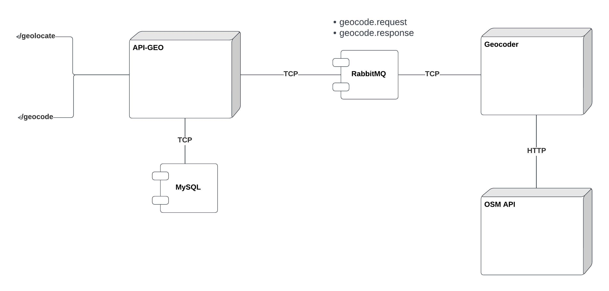

# GEO API
[](https://app.getpostman.com/run-collection/9098906-c3b36439-c172-4686-a2d0-9d172861a50f?action=collection%2Ffork&collection-url=entityId%3D9098906-c3b36439-c172-4686-a2d0-9d172861a50f%26entityType%3Dcollection%26workspaceId%3Da4bdd956-1709-4ea4-8234-f080cc7d9fc2)<br>

This is a POC project to demonstrate how to use NestJS microservices, using both RMQ only and RMQ + HTTP.<br/>
The goal is to get the geolocation (latitude and longitude) of a given address. This translation is done by the [OSM API](https://wiki.openstreetmap.org/wiki/Nominatim).<br/>
The project is composed of two microservices: `geo-api` and `geocoder`.
## Architecture
### geo-api
`geo-api` is a NestJS microservice that accepts HTTP requests for addresses through a POST /geolocate endpoint, stores the request in a SQL database, and returns an id that will be used in the GET /geocode?id={id} endpoint to retrieve the coordinates.

### geocoder
`geocoder` service is responsible for getting the coordinates from the OSM API and returning them back.

### communication
The communication between the services is done through `RMQ`, using an event-based approach. The geo-api service publishes a geocode.request event, and the geocoder service listens for it and publishes a geocode.response event with the coordinates.


## Develop
Both services have an .env.template file, you should copy it to .env and fill the variables with your own values.<br/>
For running it locally you can use:
```bash
yarn install
yarn start:dev # or yarn start
```
You should do the same for both services.

## Docker
You can run the services using docker-compose:
```bash
cd infra
docker-compose up -d --build
```

